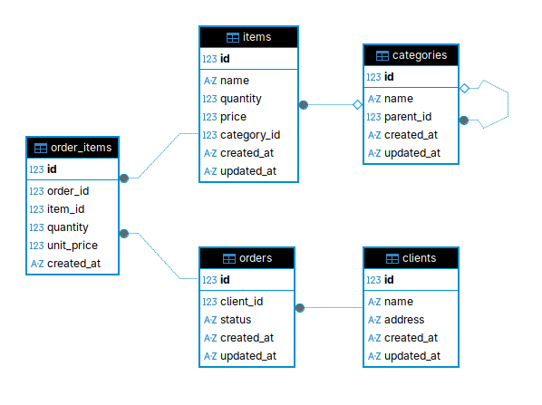

Тестовое задание

# 1. Диаграмма базы данных


# 2. SQL запросы
## 2.1 Получение  информации  о  сумме  товаров  заказанных  под  каждого  клиента (Наименование клиента, сумма)
```sql
SELECT 
	c.name, 
	COALESCE(SUM(oi.quantity * i.price), 0) AS total_price 
	FROM clients c
LEFT JOIN orders o ON c.id=o.client_id 
LEFT JOIN order_items oi ON oi.order_id = o.id
LEFT JOIN items i ON i.id = oi.item_id
GROUP BY c.id;
```
## 2.2 Найти количество дочерних элементов первого уровня вложенности для категорий номенклатуры.
```sql
WITH RECURSIVE lvl_cat AS (
    SELECT id, name, parent_id, 0 as lvl FROM categories 
    WHERE parent_id IS NULL
    UNION ALL
    SELECT c.id, c.name, c.parent_id, lc.lvl + 1 AS lvl FROM categories c
    INNER JOIN lvl_cat lc ON c.parent_id = lc.id WHERE lc.lvl < 1
)
SELECT 
    p.name AS name, 
    COUNT(c.id) AS quantity
FROM lvl_cat p
LEFT JOIN categories c ON c.parent_id = p.id
WHERE p.parent_id IS NULL
GROUP BY p.id, p.name;
```
## 2.3 Создание View
### 2.3.1 Написать текст запроса
Написать текст запроса для отчета (view) «Топ-5 самых покупаемых товаров за 
последний  месяц»  (по  количеству  штук  в  заказах).  В  отчете  должны  быть: 
Наименование товара, Категория 1-го уровня, Общее количество проданных штук.
```sql
CREATE VIEW top_5_items_last_month AS
WITH root_categories AS (
    -- Recursive CTE to find root categories
    WITH RECURSIVE category_path AS (
        SELECT id, name, parent_id, name AS root_name
        FROM categories
        WHERE parent_id IS NULL
        UNION ALL
        SELECT c.id, c.name, c.parent_id, cp.root_name
        FROM categories c
        JOIN category_path cp ON c.parent_id = cp.id
    )
    SELECT id, root_name FROM category_path
),
last_month_orders AS (
    -- Get orders from last month
    SELECT id 
    FROM orders 
    WHERE created_at >= date('now', 'start of month', '-1 month')
      AND created_at < date('now', 'start of month')
    --   for test better user current month
    -- WHERE created_at >= date('now', 'start of month')
    -- AND created_at < date('now', 'start of month', '+1 month')
)
SELECT 
    i.name AS item_name,
    COALESCE(rc.root_name, 'Uncategorized') AS category_name,
    SUM(oi.quantity) AS quantity_sold
FROM order_items oi
JOIN last_month_orders lmo ON oi.order_id = lmo.id
JOIN items i ON oi.item_id = i.id
LEFT JOIN root_categories rc ON i.category_id = rc.id
GROUP BY i.id, i.name, rc.root_name
ORDER BY quantity_sold DESC
LIMIT 5;
```

### 2.3.2  Проанализировать  написанный  в  п.  2.3.1
Проанализировать  написанный  в  п.  2.3.1  запрос  и  структуру  БД.  Предложить 
варианты  оптимизации  этого  запроса  и  общей  схемы  данных  для  повышения 
производительности системы в условиях роста данных (тысячи заказов в день).

# 3. Написать  сервис  «Добавление  товара  в  заказ» 
## Запустить автотесты (используется in memory database):
```bash 
docker compose run --rm tests
```
## Инициализировать тестовую базу данных
```bash
docker compose run --rm init_db
```

## запустить web сервис
Веб-сервис будет доступен по адресу: `http://localhost:8086/`.

Документация `swagger`: `http://localhost:8086/docs`.

Эндпоинт для добавления товара: `http://localhost:8086/add-item`
```bash
docker compose up web
```